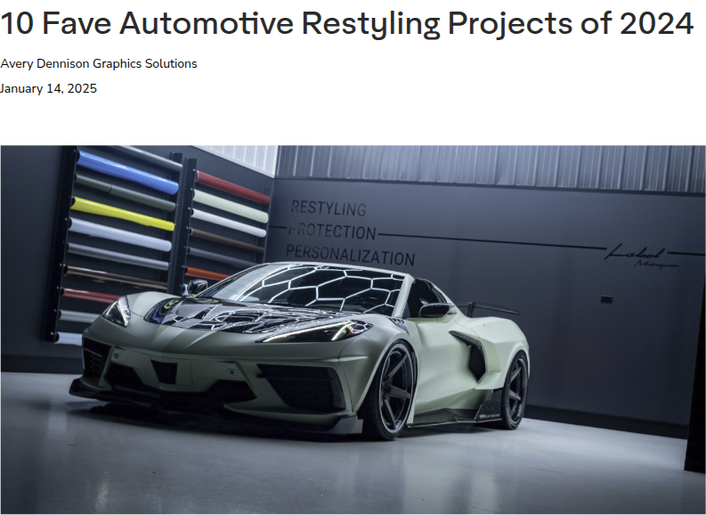

# Article Header

**Component:** `article-header`  
**DEPT mapping:** Article header  
**Used on:** 167 page(s)

Header block for press releases and blog/employee-story articles. Renders category eyebrow, headline, publish date, optional author byline, optional bold standfirst intro, an optional lead hero image, and an optional 'Download story as PDF' link. Appears on virtually every article template.

> **Migration notes:** In headless, most of these fields should live on the Article content type itself and be rendered by this component rather than authored per-instance.

## Example

*Captured live from [/en/home/news/company-blog/10-fave-automotive-restyling-projects-of-2024](https://www.averydennison.com/en/home/news/company-blog/10-fave-automotive-restyling-projects-of-2024.html) — see the [page composition](../pages/en_home_news_company-blog_10-fave-automotive-restyling-projects-of-2024/composition.md).*

## CMS data model

| Field | Type | Required | Description |
|---|---|---|---|
| `title` | string | yes | Article headline. |
| `category` | string | no | Category eyebrow, e.g. 'Avery Dennison Foundation'. |
| `publishDate` | date | no | Publish date shown under the title (merged: publishDate + date). |
| `authorName` | string | no | Author or team name, e.g. 'Communications Team'. |
| `authorRole` | string | no | Author role / business unit suffix shown after the name. |
| `standfirst` | richtext | no | Bold intro paragraph between title and byline. |
| `heroImage` | image | no | Lead editorial photo below the title. |
| `heroImageAlt` | string | no | Alt text for the lead image. |
| `pdfUrl` | link | no | DAM URL of the PDF version of the story (merged: pdfUrl + downloadUrl + downloadPdfUrl). |
| `pdfLabel` | string | no | Label of the PDF download link, default 'Download story as PDF' (merged: pdfLabel + downloadLabel). |

## Used on slugs

- `/en/home/news/company-blog/10-fave-automotive-restyling-projects-of-2024`
- `/en/home/news/company-blog/22-reasons-employees-say-avery-dennison-is-a-great-place-to-work`
- `/en/home/news/company-blog/3rd-trafficjet-printer-for-bb-skilti-iceland`
- `/en/home/news/company-blog/50-years-of-reflective-solutions-in-brazil`
- `/en/home/news/company-blog/a-conversation-with-shruti-george`
- `/en/home/news/company-blog/adf-action-against-hunger`
- `/en/home/news/company-blog/adf-celebrates-pride-and-partners-making-a-difference`
- `/en/home/news/company-blog/adf-grantee-global-fund-for-children`
- `/en/home/news/company-blog/adf-scholars-demonstrate-education-access-in-action`
- `/en/home/news/company-blog/adf-scholars-spotlight-august-2024`
- `/en/home/news/company-blog/avery-dennison-and-employees-lend-a-hand-to-ukraine`
- `/en/home/news/company-blog/avery-dennison-foundation-celebrates-international-womens-day`
- `/en/home/news/company-blog/avery-dennison-foundation-grant-is-empowering-ai-leadership-for-women-across-asia`
- `/en/home/news/company-blog/avery-dennison-foundation-helps-kids-of-employees-achieve-their-dreams-of-higher-education`
- `/en/home/news/company-blog/avery-dennison-foundation-invests-in-womens-empowerment`
- `/en/home/news/company-blog/avery-dennison-foundation-shares-new-strategy-address-global-challenges`
- `/en/home/news/company-blog/avery-dennison-helps-2-make-a-wish-kids-wishes-come-true`
- `/en/home/news/company-blog/avery-dennison-it-announces-2025-supplier-excellence-award-winners`
- `/en/home/news/company-blog/avery-dennison-north-america-sites-raise-over-500k-for-united-way`
- `/en/home/news/company-blog/avery-dennison-recognized-for-another-industry-first`
- `/en/home/news/company-blog/avery-dennison-reflective-solutions-enhances-safety-in-indias-first-hybrid-ambulance`
- `/en/home/news/company-blog/brimos-produces-high-quality-overhead-guide-signs-with-ease-using-trafficjet-pro`
- `/en/home/news/company-blog/building-markets-an-adf-grantee`
- `/en/home/news/company-blog/celebrating-25-years-in-india`
- `/en/home/news/company-blog/celebrating-earth-day-with-global-forest-generation`
- `/en/home/news/company-blog/celebrating-hispanic-heritage-month`
- `/en/home/news/company-blog/celebrating-the-2024-avery-dennison-foundation-leadership-excellence-awardees`
- `/en/home/news/company-blog/choose-fluorescent-for-work-zone-signage`
- `/en/home/news/company-blog/create-more-with-avery-dennison-top-25-supreme-wrapping-film-colors`
- `/en/home/news/company-blog/design-your-dream-car-wrap-with-the-avery-dennison-car-wrap-visualizer`
- `/en/home/news/company-blog/ecovias-launches-vertical-sign-center-with-trafficjet`
- `/en/home/news/company-blog/expanding-the-discussion-on-work-zone-safety`
- `/en/home/news/company-blog/first-trafficjet-xpress-printer-installed-at-trafficsupply`
- `/en/home/news/company-blog/first-trafficjet-xpress-printer-installed-in-france`
- `/en/home/news/company-blog/global-impact-for-iwd`
- `/en/home/news/company-blog/global-pride-initiatives-adf`
- `/en/home/news/company-blog/graphics-solutions-favorite-projects-of-q1-2025`
- `/en/home/news/company-blog/graphics-solutions-favorite-projects-of-q2-2025`
- `/en/home/news/company-blog/graphics-solutions-favorite-projects-of-q3-2025`
- `/en/home/news/company-blog/graphics-solutions-favorite-projects-of-q4-2025`
- `/en/home/news/company-blog/happy-pride-introducing-unite-employee-resource-group`
- `/en/home/news/company-blog/helping-tourists-navigate-italy-with-vibrant-full-color-reflective-signs`
- `/en/home/news/company-blog/high-mast-signs-for-the-indian-oil-industry-go-digital`
- `/en/home/news/company-blog/how-it-shared-services-are-a-digital-metropolis-helping-companies-on-their-transformation-journey`
- `/en/home/news/company-blog/improving-roadway-safety-in-brazil-for-more-than-20-years`
- `/en/home/news/company-blog/international-standard-for-vehicle-markings-astm-d8514`
- `/en/home/news/company-blog/introducing-avery-dennison-black-employee-resource-group`
- `/en/home/news/company-blog/introducing-avery-dennison-elevate-employee-resource-group`
- `/en/home/news/company-blog/introducing-veterans-employee-resource-group`
- `/en/home/news/company-blog/inventing-the-future`
- `/en/home/news/company-blog/is-vehicle-customization-the-best-route-to-shop-growth`
- `/en/home/news/company-blog/labelexpo-americas-2024`
- `/en/home/news/company-blog/next-level-innovation-z2010-passes-the-ice-bucket-test`
- `/en/home/news/company-blog/nobilis-d-o-o-boosts-traffic-sign-production-trafficjet`
- `/en/home/news/company-blog/ol-1200-anti-dew-film-protecting-traffic-signs-in-the-uk`
- `/en/home/news/company-blog/ol-1200-anti-dew-film-protecting-traffic-signs-in-uk`
- `/en/home/news/company-blog/paving-the-path-to-continuous-modernization-and-business-value`
- `/en/home/news/company-blog/pride-2022-meet-members-of-unite-kelly-ruffenach`
- `/en/home/news/company-blog/pride-2023-meet-members-of-unite-alice-li`
- `/en/home/news/company-blog/pride-2023-meet-members-of-unite-florian-schwickert`
- `/en/home/news/company-blog/pride-2023-meet-members-of-unite-maria-ocampo`
- `/en/home/news/company-blog/pride-2023-meet-unite-ally-will-sandman`
- `/en/home/news/company-blog/protect-traffic-signs-from-dew`
- `/en/home/news/company-blog/protecting-traffic-signs-in-serbia-from-dew-ol-1200`
- `/en/home/news/company-blog/rooted-in-community-avery-dennison-brazil-is-sustaining-what-matters-most`
- `/en/home/news/company-blog/safer-roads-safer-mobility`
- `/en/home/news/company-blog/shop-profits-productivity-and-professionalism-get-a-big-boost`
- `/en/home/news/company-blog/shops-and-installers-in-the-news-13-avery-dennison-success-stories`
- `/en/home/news/company-blog/standing-still-is-going-backwards`
- `/en/home/news/company-blog/tackling-tomorrows-top-business-challenges-with-two-simple-words`
- `/en/home/news/company-blog/taking-command-of-color`
- `/en/home/news/company-blog/the-future-of-ai-business-with-nick-colisto`
- `/en/home/news/company-blog/the-roadshow-that-transformed-buenos-aires`
- `/en/home/news/company-blog/top-10-supreme-wrapping-film-colors-2025`
- `/en/home/news/company-blog/trafficjet-pro-finds-a-house-in-germany`
- `/en/home/news/company-blog/trafficjet-pro-osburn-signs`
- `/en/home/news/company-blog/trafficjet-pro-speeds-up-production-at-industrias-saludes-in-spain`
- `/en/home/news/company-blog/trafficjet-pro-successfully-installed-at-nour-massah`
- `/en/home/news/company-blog/trafficjet-xpert-installed-at-medivia-kft-hungary`
- `/en/home/news/company-blog/updates-to-build-america-buy-america-requirements`
- `/en/home/news/company-blog/vehicle-safety-in-saudi-arabia-leveled-up-by-adopting-logo-conspicuity-tape`
- `/en/home/news/company-blog/voz-latina-employee-resource-group`
- `/en/home/news/company-blog/welsh-sign-manufacturer-speeds-up-productivity-with-trafficjet-pro`
- `/en/home/news/company-blog/what-to-look-for-in-a-color-change-and-full-vehicle-wrap`
- `/en/home/news/company-blog/what-to-look-for-in-an-auto-window-film-ft-harold-nimtz`
- `/en/home/news/company-blog/what-would-stan-think-90-years-of-avery-dennison`
- `/en/home/news/company-blog/what-you-need-to-know-ppf-narayan-andrews`
- `/en/home/news/company-blog/winter-proof-your-vinyl-installs`
- `/en/home/news/company-blog/yungatha-expands-with-trafficjet-xpress`
- `/en/home/news/leadership-perspectives/nick-colisto/championing-collaboration`
- `/en/home/news/leadership-perspectives/nick-colisto/cutting-through-complexity`
- `/en/home/news/leadership-perspectives/nick-colisto/engineering-leadership-from-within`
- `/en/home/news/leadership-perspectives/nick-colisto/execution-is-a-leadership-behavior-not-an-operational-task`
- `/en/home/news/leadership-perspectives/nick-colisto/from-problem-solving-capability-building-ai`
- `/en/home/news/leadership-perspectives/nick-colisto/how-it-shared-services-are-a-digital-metropolis-helping-companies-on-their-transformation-journey`
- `/en/home/news/leadership-perspectives/nick-colisto/leading-change-in-the-digital-era`
- `/en/home/news/leadership-perspectives/nick-colisto/living-our-values-through-technology`
- `/en/home/news/leadership-perspectives/nick-colisto/net-zero-it`
- `/en/home/news/leadership-perspectives/nick-colisto/paving-the-path-to-continuous-modernization-and-business-value`
- `/en/home/news/leadership-perspectives/nick-colisto/the-four-digital-experiences-powering-growth-and-efficiency`
- `/en/home/news/leadership-perspectives/nick-colisto/the-future-of-ai-business-with-nick-colisto`
- `/en/home/news/leadership-perspectives/nick-colisto/the-journey-to-high-road-leadership`
- `/en/home/news/leadership-perspectives/nick-colisto/the-strategic-advantages-of-inclusive-leadership-in-it`
- `/en/home/news/leadership-perspectives/nick-colisto/what-happens-when-you-put-exceptional-tools-in-the-hands-of-exceptional-people`
- `/en/home/news/press-releases/540-billion-global-food-waste-bill-exposed-for-2026`
- `/en/home/news/press-releases/RETHINK-retail-recognizes-julie-vargas`
- `/en/home/news/press-releases/avery-dennison-acquires-catchpoint-ip`
- `/en/home/news/press-releases/avery-dennison-acquires-rietveld`
- `/en/home/news/press-releases/avery-dennison-acquires-textrace`
- `/en/home/news/press-releases/avery-dennison-and-the-premier-league-present-the-name-behind-the-numbers`
- `/en/home/news/press-releases/avery-dennison-and-walmart-collaborate-to-enhance-freshness-rfid`
- `/en/home/news/press-releases/avery-dennison-and-wiliot-expand-strategic-partnership`
- `/en/home/news/press-releases/avery-dennison-announces-fourth-quarter-and-full-year-2021-results`
- `/en/home/news/press-releases/avery-dennison-announces-fourth-quarter-and-full-year-2022-results`
- `/en/home/news/press-releases/avery-dennison-announces-planned-ceo-succession`
- `/en/home/news/press-releases/avery-dennison-announces-q1-2022-results`
- `/en/home/news/press-releases/avery-dennison-announces-q1-2023-results`
- `/en/home/news/press-releases/avery-dennison-announces-q1-2024-results`
- `/en/home/news/press-releases/avery-dennison-announces-q1-2025-results`
- `/en/home/news/press-releases/avery-dennison-announces-q1-2026-results`
- `/en/home/news/press-releases/avery-dennison-announces-q2-2022-results`
- `/en/home/news/press-releases/avery-dennison-announces-q2-2023-results`
- `/en/home/news/press-releases/avery-dennison-announces-q2-2024-results`
- `/en/home/news/press-releases/avery-dennison-announces-q2-2025-results`
- `/en/home/news/press-releases/avery-dennison-announces-q3-2022-results`
- `/en/home/news/press-releases/avery-dennison-announces-q3-2023-results`
- `/en/home/news/press-releases/avery-dennison-announces-q3-2024-results`
- `/en/home/news/press-releases/avery-dennison-announces-q3-2025-results`
- `/en/home/news/press-releases/avery-dennison-announces-q4-and-full-year-2023-results`
- `/en/home/news/press-releases/avery-dennison-announces-q4-and-full-year-2024-results`
- `/en/home/news/press-releases/avery-dennison-announces-q4-and-full-year-2025-results`
- `/en/home/news/press-releases/avery-dennison-announces-strategic-75-million-investment-in-wiliot-to-scale-physical-ai`
- `/en/home/news/press-releases/avery-dennison-commissions-europes-largest-concentrated-solar-thermal-platform-and-thermal-storage-unit-in-turnhout-belgium`
- `/en/home/news/press-releases/avery-dennison-completes-acquisition-of-meridians-flooring-business`
- `/en/home/news/press-releases/avery-dennison-earns-top-score-on-hrc-foundation-2022-corporate-equality-index`
- `/en/home/news/press-releases/avery-dennison-expands-rfid-adoption-in-grocery-retail-industry`
- `/en/home/news/press-releases/avery-dennison-fortifies-its-presence-in-india`
- `/en/home/news/press-releases/avery-dennison-invests-in-series-b-funding-of-3d-current-collectors-manufacturer-addionics`
- `/en/home/news/press-releases/avery-dennison-it-announces-inaugural-supplier-excellence-award-winners`
- `/en/home/news/press-releases/avery-dennison-joins-WBCSD`
- `/en/home/news/press-releases/avery-dennison-launches-ad-identifresh`
- `/en/home/news/press-releases/avery-dennison-launches-ad-stretch-accelerator-program`
- `/en/home/news/press-releases/avery-dennison-materials-group-names-matthias-matt-liebert-as-general-manager-for-taylor-adhesives`
- `/en/home/news/press-releases/avery-dennison-names-deon-stander-president-and-chief-operating-officer`
- `/en/home/news/press-releases/avery-dennison-names-presidents-for-two-business-segments`
- `/en/home/news/press-releases/avery-dennison-names-ryan-yost-president-materials-group`
- `/en/home/news/press-releases/avery-dennison-names-senior-vice-president-and-general-manager-materials-group-na`
- `/en/home/news/press-releases/avery-dennison-opens-first-india-based-rfid-production-facility`
- `/en/home/news/press-releases/avery-dennison-partners-to-fund-innovation-with-emerald-technology-ventures`
- `/en/home/news/press-releases/avery-dennison-scores-strategic-partnership-position-with-LaLiga`
- `/en/home/news/press-releases/avery-dennison-signs-a-definitive-agreement-to-acquire-silver-crystal-group`
- `/en/home/news/press-releases/avery-dennison-signs-agreement-to-acquire-thermopatch`
- `/en/home/news/press-releases/avery-dennison-to-acquire-meridians-flooring-business`
- `/en/home/news/press-releases/avery-dennison-to-invest-over-60-million-euros-in-expansion-in-europe`
- `/en/home/news/press-releases/avery-dennison-to-reveal-how-rfid-is-revolutionizing-retail-nrf`
- `/en/home/news/press-releases/basf-and-avery-dennison-collaborate-to-launch-acrylates-based-on-renewable-electricity`
- `/en/home/news/press-releases/currys-rolls-out-electronic-shelf-edge-labelling`
- `/en/home/news/press-releases/electrified-with-avery-dennison`
- `/en/home/news/press-releases/estimated-94-billion-dollar-meat-waste-bill-significant-retail-inventory-challenge`
- `/en/home/news/press-releases/fast-company-recognizes-avery-dennison-worlds-most-innovative-companies`
- `/en/home/news/press-releases/industry-first-rfid-label-recognized-by-apr-for-compatibility-with-pet-recycling-stream`
- `/en/home/news/press-releases/new-cardinal-health-surgical-drape-features-avery-dennison-benehold-chg-adhesive-technology`
- `/en/home/news/press-releases/new-research-shines-a-light-on-grocery-shoppers-reactions-to-in-store-digitization`
- `/en/home/news/press-releases/online-shoppers-crave-control`
- `/en/home/news/press-releases/turning-potential-into-operational-success-avery-dennison-gets-set-for-retails-big-show`
- `/en/home/news/press-releases/unlocking-growth-and-sustainability`
- `/en/home/news/press-releases/vestcom-research-reveals-the-power-of-in-store-media-maximizing-impact`
