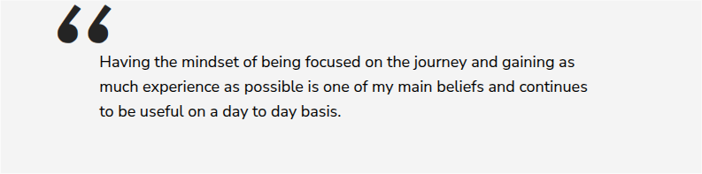

# Article Quote

**Component:** `article-quote`  
**DEPT mapping:** Quote Block - Article  
**Used on:** 71 page(s)

Pull-quote / testimonial block used inside articles and on careers pages. Shows a large quote with optional attribution (name, role, business unit) and an optional circular portrait photo of the speaker.

> **Migration notes:** Distinct from testimonial-card (multi-card grid on the campaign report page).

## Example

*Captured live from [/en/home/careers/employee-stories/alexandrina-cheptanaru](https://www.averydennison.com/en/home/careers/employee-stories/alexandrina-cheptanaru.html) — see the [page composition](../pages/en_home_careers_employee-stories_alexandrina-cheptanaru/composition.md).*

## CMS data model

| Field | Type | Required | Description |
|---|---|---|---|
| `quote` | richtext | yes | Quote text. |
| `authorName` | string | no | Attribution name (merged: authorName + attribution.name + attribution). |
| `authorRole` | string | no | Attribution role/title (merged: authorRole + attribution.role). |
| `authorBusiness` | string | no | Business unit, e.g. 'Materials Group'. |
| `portrait` | image | no | Circular portrait photo (merged: image + portrait). |

## Used on slugs

- `/en/home/careers/early-career-opportunities`
- `/en/home/careers/early-career-opportunities/asia-pacific`
- `/en/home/careers/employee-stories/alexandrina-cheptanaru`
- `/en/home/careers/employee-stories/ana-cervantes`
- `/en/home/careers/employee-stories/andre-salmazzo`
- `/en/home/careers/employee-stories/andrea-gissi`
- `/en/home/careers/employee-stories/anniek-wiltink`
- `/en/home/careers/employee-stories/anula-prokopowicz`
- `/en/home/careers/employee-stories/arnela-hodzic-isakovic`
- `/en/home/careers/employee-stories/artur-praski`
- `/en/home/careers/employee-stories/artur-praski/artur-praski-local`
- `/en/home/careers/employee-stories/cristina-linte-glass`
- `/en/home/careers/employee-stories/diego-saul`
- `/en/home/careers/employee-stories/fabrice-bayle`
- `/en/home/careers/employee-stories/femke-zijlstra`
- `/en/home/careers/employee-stories/gayan-fernando`
- `/en/home/careers/employee-stories/ioanna-georgiou`
- `/en/home/careers/employee-stories/ivete-dias`
- `/en/home/careers/employee-stories/jenny-hu`
- `/en/home/careers/employee-stories/jigyasa-daiya`
- `/en/home/careers/employee-stories/john-ellison`
- `/en/home/careers/employee-stories/jolanta-wojciechowska`
- `/en/home/careers/employee-stories/jonas-janiunas`
- `/en/home/careers/employee-stories/juliana-bonani`
- `/en/home/careers/employee-stories/juliana-bonani/juliana-bonani-local`
- `/en/home/careers/employee-stories/katarina-kelam`
- `/en/home/careers/employee-stories/krisakorn-rerkrai`
- `/en/home/careers/employee-stories/marie-brochenin`
- `/en/home/careers/employee-stories/merve-ozdemir-ceran`
- `/en/home/careers/employee-stories/michael-bruon`
- `/en/home/careers/employee-stories/michael-kampers`
- `/en/home/careers/employee-stories/mutlu-cavusoglu`
- `/en/home/careers/employee-stories/panisara-marukapitak`
- `/en/home/careers/employee-stories/paul-dunn`
- `/en/home/careers/employee-stories/pierre-goedert`
- `/en/home/careers/employee-stories/richard-ohm`
- `/en/home/careers/employee-stories/richard-rigg`
- `/en/home/careers/employee-stories/rob-de-koning`
- `/en/home/careers/employee-stories/robin-cote`
- `/en/home/careers/employee-stories/royce-mason`
- `/en/home/careers/employee-stories/sabrina-garcia`
- `/en/home/careers/employee-stories/sanaa-iqbal`
- `/en/home/careers/employee-stories/severine-marquet`
- `/en/home/careers/employee-stories/sheila-yanes`
- `/en/home/careers/employee-stories/tiina-vuorinen`
- `/en/home/careers/employee-stories/truc-le`
- `/en/home/careers/employee-stories/valentin-rock`
- `/en/home/careers/employee-stories/ventsislav-lihachov`
- `/en/home/careers/employee-stories/venus-liu`
- `/en/home/careers/employee-stories/zuzanna-kokot`
- `/en/home/company/avery-dennison-foundation`
- `/en/home/news/company-blog/avery-dennison-recognized-for-another-industry-first`
- `/en/home/news/company-blog/global-impact-for-iwd`
- `/en/home/news/company-blog/how-it-shared-services-are-a-digital-metropolis-helping-companies-on-their-transformation-journey`
- `/en/home/news/company-blog/paving-the-path-to-continuous-modernization-and-business-value`
- `/en/home/news/company-blog/the-future-of-ai-business-with-nick-colisto`
- `/en/home/news/leadership-perspectives/nick-colisto/championing-collaboration`
- `/en/home/news/leadership-perspectives/nick-colisto/cutting-through-complexity`
- `/en/home/news/leadership-perspectives/nick-colisto/engineering-leadership-from-within`
- `/en/home/news/leadership-perspectives/nick-colisto/execution-is-a-leadership-behavior-not-an-operational-task`
- `/en/home/news/leadership-perspectives/nick-colisto/from-problem-solving-capability-building-ai`
- `/en/home/news/leadership-perspectives/nick-colisto/how-it-shared-services-are-a-digital-metropolis-helping-companies-on-their-transformation-journey`
- `/en/home/news/leadership-perspectives/nick-colisto/leading-change-in-the-digital-era`
- `/en/home/news/leadership-perspectives/nick-colisto/living-our-values-through-technology`
- `/en/home/news/leadership-perspectives/nick-colisto/net-zero-it`
- `/en/home/news/leadership-perspectives/nick-colisto/paving-the-path-to-continuous-modernization-and-business-value`
- `/en/home/news/leadership-perspectives/nick-colisto/the-four-digital-experiences-powering-growth-and-efficiency`
- `/en/home/news/leadership-perspectives/nick-colisto/the-future-of-ai-business-with-nick-colisto`
- `/en/home/news/leadership-perspectives/nick-colisto/the-journey-to-high-road-leadership`
- `/en/home/news/leadership-perspectives/nick-colisto/the-strategic-advantages-of-inclusive-leadership-in-it`
- `/en/home/news/leadership-perspectives/nick-colisto/what-happens-when-you-put-exceptional-tools-in-the-hands-of-exceptional-people`
