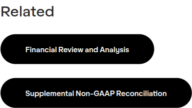

# Button Group

**Component:** `button-group`  
**DEPT mapping:** Button group  
**Used on:** 3 page(s)

Horizontal group of one or more buttons, optionally introduced by a small heading (e.g. 'Related'). Observed with a single red pill anchor-link button on the campaign report page and in press-release sidebars.

## Example

*Captured live from [/en/home/news/press-releases/avery-dennison-announces-fourth-quarter-and-full-year-2021-results](https://www.averydennison.com/en/home/news/press-releases/avery-dennison-announces-fourth-quarter-and-full-year-2021-results.html) — see the [page composition](../pages/en_home_news_press-releases_avery-dennison-announces-fourth-quarter-and-full-year-2021-results/composition.md).*

## CMS data model

| Field | Type | Required | Description |
|---|---|---|---|
| `heading` | string | no | Optional heading above the group. |
| `buttons` | array<object> | yes | Buttons. Each: {label (string, required), url (link, required), variant (enum: primary | secondary | dark)}. |

## Used on slugs

- `/en/home/news/press-releases/avery-dennison-announces-fourth-quarter-and-full-year-2021-results`
- `/en/home/news/press-releases/avery-dennison-announces-q3-2022-results`
- `/en/home/unlocking-food-waste-value-report`
