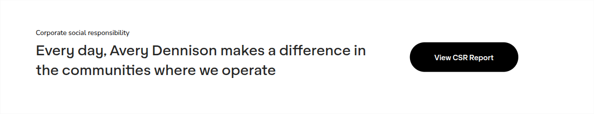

# CTA Block

**Component:** `cta-block`  
**DEPT mapping:** CTA Block  
**Used on:** 71 page(s)

Card-style call-to-action container: eyebrow, heading, rich body and a pill CTA button, optionally with a small campaign logo/icon beside the heading. Variants observed: a 4-column teaser row linking to sibling campaign pages (shared experience fragment), and a boxed content card with rich bulleted copy wrapped around an inline image ('Shop stories').

> **Migration notes:** Absorbs raw 'content-card' (single-use boxed card; analyst mapped it to CTA Block). The 4-column teaser usage was an AEM experience fragment shared across EU-policy pages — model as a reusable entry.

## Example

*Captured live from [/en/home](https://www.averydennison.com/en/home.html) — see the [page composition](../pages/en_home/composition.md).*

## CMS data model

| Field | Type | Required | Description |
|---|---|---|---|
| `variant` | string | no | Enum: banner | contentCard | teaserColumns. |
| `eyebrow` | string | no | Eyebrow label, e.g. 'Corporate social responsibility'. |
| `heading` | string | yes | CTA/card heading. |
| `body` | richtext | no | Main copy (merged: body + bodyTop). |
| `image` | image | no | Inline photo in the middle of the content card variant. |
| `secondaryBody` | richtext | no | Copy below the inline image (merged: bodyBottom). |
| `icon` | image | no | Small campaign logo/mark beside the heading. |
| `ctaLabel` | string | no | Button label, e.g. 'View CSR Report'. |
| `ctaUrl` | link | no | Button target. |
| `items` | array<object> | no | teaserColumns variant: teaser links to related pages. Each: {title (string), text (string), linkLabel (string), linkUrl (link)}. |

## Used on slugs

- `/en/home`
- `/en/home/careers/early-career-opportunities/asia-pacific`
- `/en/home/careers/early-career-opportunities/asia-pacific/ad-nextgen-program`
- `/en/home/careers/early-career-opportunities/asia-pacific/internship-program`
- `/en/home/careers/early-career-opportunities/asia-pacific/lead-program`
- `/en/home/careers/early-career-opportunities/europe`
- `/en/home/careers/early-career-opportunities/europe/commercial`
- `/en/home/careers/early-career-opportunities/europe/data-science`
- `/en/home/careers/early-career-opportunities/europe/faq`
- `/en/home/careers/early-career-opportunities/europe/finance`
- `/en/home/careers/early-career-opportunities/europe/operations`
- `/en/home/careers/early-career-opportunities/europe/research-and-development`
- `/en/home/careers/early-career-opportunities/europe/sales`
- `/en/home/careers/early-career-opportunities/europe/supply-chain`
- `/en/home/careers/early-career-opportunities/global`
- `/en/home/careers/early-career-opportunities/north-america`
- `/en/home/careers/employee-stories/alexandrina-cheptanaru`
- `/en/home/careers/employee-stories/ana-cervantes`
- `/en/home/careers/employee-stories/andre-salmazzo`
- `/en/home/careers/employee-stories/andrea-gissi`
- `/en/home/careers/employee-stories/anniek-wiltink`
- `/en/home/careers/employee-stories/anula-prokopowicz`
- `/en/home/careers/employee-stories/arnela-hodzic-isakovic`
- `/en/home/careers/employee-stories/artur-praski`
- `/en/home/careers/employee-stories/artur-praski/artur-praski-local`
- `/en/home/careers/employee-stories/cristina-linte-glass`
- `/en/home/careers/employee-stories/diego-saul`
- `/en/home/careers/employee-stories/fabrice-bayle`
- `/en/home/careers/employee-stories/femke-zijlstra`
- `/en/home/careers/employee-stories/gayan-fernando`
- `/en/home/careers/employee-stories/ioanna-georgiou`
- `/en/home/careers/employee-stories/ivete-dias`
- `/en/home/careers/employee-stories/jenny-hu`
- `/en/home/careers/employee-stories/jigyasa-daiya`
- `/en/home/careers/employee-stories/john-ellison`
- `/en/home/careers/employee-stories/jolanta-wojciechowska`
- `/en/home/careers/employee-stories/jonas-janiunas`
- `/en/home/careers/employee-stories/juliana-bonani`
- `/en/home/careers/employee-stories/juliana-bonani/juliana-bonani-local`
- `/en/home/careers/employee-stories/katarina-kelam`
- `/en/home/careers/employee-stories/krisakorn-rerkrai`
- `/en/home/careers/employee-stories/marie-brochenin`
- `/en/home/careers/employee-stories/merve-ozdemir-ceran`
- `/en/home/careers/employee-stories/michael-bruon`
- `/en/home/careers/employee-stories/michael-kampers`
- `/en/home/careers/employee-stories/mutlu-cavusoglu`
- `/en/home/careers/employee-stories/panisara-marukapitak`
- `/en/home/careers/employee-stories/paul-dunn`
- `/en/home/careers/employee-stories/pierre-goedert`
- `/en/home/careers/employee-stories/richard-ohm`
- `/en/home/careers/employee-stories/richard-rigg`
- `/en/home/careers/employee-stories/rob-de-koning`
- `/en/home/careers/employee-stories/robin-cote`
- `/en/home/careers/employee-stories/royce-mason`
- `/en/home/careers/employee-stories/sabrina-garcia`
- `/en/home/careers/employee-stories/sanaa-iqbal`
- `/en/home/careers/employee-stories/severine-marquet`
- `/en/home/careers/employee-stories/sheila-yanes`
- `/en/home/careers/employee-stories/tiina-vuorinen`
- `/en/home/careers/employee-stories/truc-le`
- `/en/home/careers/employee-stories/valentin-rock`
- `/en/home/careers/employee-stories/ventsislav-lihachov`
- `/en/home/careers/employee-stories/venus-liu`
- `/en/home/careers/employee-stories/zuzanna-kokot`
- `/en/home/company/overview`
- `/en/home/eu-policy/europes-waste-problem`
- `/en/home/eu-policy/our-vision-more-sustainable-competitive-europe-connecting-physical-and-digital`
- `/en/home/eu-policy/sustainable-supply-chains`
- `/en/home/industries`
- `/en/home/news/company-blog/shops-and-installers-in-the-news-13-avery-dennison-success-stories`
- `/en/home/technologies`
