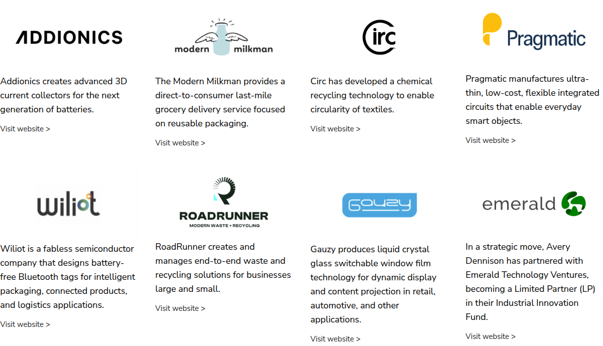

# Logo Grid

**Component:** `logo-grid`  
**DEPT mapping:** Tiles / Logo Grid  
**Used on:** 1 page(s)

Grid of partner/portfolio logos, observed as a 4-column grid of logo + description + 'Visit website' link pairs (ventures portfolio) and as plain white logo cards without text (startup cohort partners).

> **Migration notes:** Logo rows inside press releases were authored as image/side-by-side components; editors should switch to this block after migration.

## Example

*Captured live from [/en/home/company/corporate-venture-capital-program](https://www.averydennison.com/en/home/company/corporate-venture-capital-program.html) — see the [page composition](../pages/en_home_company_corporate-venture-capital-program/composition.md).*

## CMS data model

| Field | Type | Required | Description |
|---|---|---|---|
| `heading` | string | no | Optional section heading. |
| `items` | array<object> | yes | Logo entries (merged: items[] + logos[]). Each: {logo (image, required), alt (string), description (richtext, optional), linkLabel (string, e.g. 'Visit website >'), linkUrl (link)}. |
| `columns` | number | no | Grid columns (observed 4). |

## Used on slugs

- `/en/home/company/corporate-venture-capital-program`
