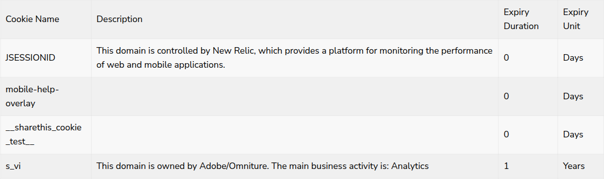

# Table Block

**Component:** `table`  
**DEPT mapping:** Table Block  
**Used on:** 10 page(s)

Tabular content in three observed shapes: alternating-row link tables grouped under section headings (news indexes, year-by-year report archives), header-driven data tables (cookie tables, toll-free number directory with optional region sub-groups and language links), and a campaign 'dotted table' definition list — label + description rows separated by dotted rules on a dark band.

> **Migration notes:** Absorbs raw 'campaign-table' (bespoke nourish-table HTML) as the definitionList variant. Its share-page rows with iconLinks[] and click-to-copy text are one-off campaign functionality — migrate that single page with html-embed or a bespoke share module, not this model. Needs reconciliation with DEPT on whether authored via a richtext table editor or structured rows.

## Example

*Captured live from [/en/home/cookie-policy/cookie-overview](https://www.averydennison.com/en/home/cookie-policy/cookie-overview.html) — see the [page composition](../pages/en_home_cookie-policy_cookie-overview/composition.md).*

## CMS data model

| Field | Type | Required | Description |
|---|---|---|---|
| `variant` | string | yes | Enum: linkTable | dataTable | definitionList. |
| `title` | string | no | Table heading, e.g. 'How Avery Dennison helps'. |
| `theme` | string | no | Enum: default | dark. Dark variant with white dotted rules (definitionList). |
| `headers` | array<string> | no | Column headers (dataTable variant). |
| `sections` | array<object> | no | Optional grouping sections. Each: {heading (string, company/site name), groups (array<object>: {regionLabel (string), links (array<object>: {label, url})}), rows (see rows field)}. |
| `rows` | array<object> | yes | Table rows (merged: rows[] + sections[].rows[]). Each: {label (string, definition-list row label), description (string), date (string), linkLabel (string), linkUrl (link)}. |

## Used on slugs

- `/en/home/company/corporate-venture-capital-program/portfolio-in-the-news`
- `/en/home/company/reports/integrated-report`
- `/en/home/contact-us/business-conduct-guideline-directory`
- `/en/home/cookie-policy/cookie-overview`
- `/en/home/global-website-directory`
- `/en/home/industries/supply-chain-and-logistics`
- `/en/home/legal-and-privacy-notices/avery-dennison-general-terms-and-conditions-of-purchase`
- `/en/home/news/company-blog/22-reasons-employees-say-avery-dennison-is-a-great-place-to-work`
- `/en/home/unlocking-food-waste-value-report`
- `/en/home/unlocking-food-waste-value-report/share`
